# REDDY Agent


> A browser-accessible AI cockpit: an iterative Gemini agent loop, session memory with pruning, a dynamic tool and skill registry, a knowledge vault, Google Workspace operations, host diagnostics, and task telemetry — in one dashboard.

REDDY is not a chat wrapper with extra chrome. Every panel on the screen maps to a subsystem you can read in this repository: the loop in `core/engine.ts`, the memory window in `core/memory.ts`, the registry in `core/registry.ts`, the provider in `core/orchestrator.ts`, and fourteen Express routes in `server.ts`. This document presents the system as it exists — including its limits, which are stated plainly in [Operational characteristics](#operational-characteristics).

| Spec | Value |
|---|---|
| Runtime | Node.js + Express 4 (`server.ts`), port 3000 by default (`PORT` overrides) |
| Frontend | React 19 + Vite 6 + Tailwind CSS 4, `motion`, `recharts`, `lucide-react` |
| Agent core | `RedAeyeEngine` — iterative tool-calling loop, 5-iteration safety cap |
| Provider | Google Gemini `gemini-1.5-flash` via `@google/genai` |
| Skills | 1 built-in (`System_Info`) + runtime text-skill injection |
| Memory | Per-session `MemoryVault`, 50-message window, episodic summary |
| API surface | 14 JSON routes under `/api` |
| Auth | Firebase Google OAuth for Google Workspace operations (browser-side) |
| Tests | 57 tests across 7 files — `npm test` |

---

## Contents

- [The cockpit](#the-cockpit)
- [Visual language](#visual-language)
- [Agent architecture](#agent-architecture)
  - [Agent loop](#agent-loop)
  - [Provider orchestration](#provider-orchestration)
  - [Session memory and context pruning](#session-memory-and-context-pruning)
  - [Tool registry and tool contracts](#tool-registry-and-tool-contracts)
  - [Dynamic skill loading](#dynamic-skill-loading)
  - [Knowledge Vault](#knowledge-vault)
  - [Google Workspace operations](#google-workspace-operations)
  - [Firebase authentication and the security boundary](#firebase-authentication-and-the-security-boundary)
  - [System diagnostics](#system-diagnostics)
  - [Task history and telemetry](#task-history-and-telemetry)
  - [API-key management](#api-key-management)
  - [Purge and reset operations](#purge-and-reset-operations)
  - [API console](#api-console)
- [Install, configure, build](#install-configure-build)
  - [Requirements](#requirements)
  - [Install](#install)
  - [Environment](#environment)
  - [Development server](#development-server)
  - [Production build](#production-build)
  - [Scripts](#scripts)
  - [Test suite](#test-suite)
  - [Smoke test](#smoke-test)
  - [Deployment](#deployment)
  - [Operational characteristics](#operational-characteristics)
  - [Troubleshooting](#troubleshooting)
- [Verification](#verification)
- [Repository layout](#repository-layout)
- [Open engineering questions](#open-engineering-questions)

---

## The cockpit

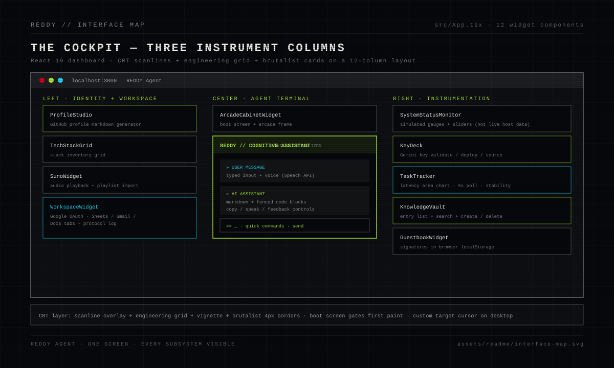

The dashboard is a single screen divided into three instrument columns (`src/App.tsx`):

- **Left — identity and workspace.** `ProfileStudio` (GitHub profile markdown generation), `TechStackGrid`, `SunoWidget` (audio playback + playlist import), and `WorkspaceWidget` (Google Workspace operations behind Google sign-in).
- **Center — the agent terminal.** An arcade-cabinet frame wrapping the chat console: skill count in the header, a message stream that renders fenced code blocks with copy buttons, feedback and speak-aloud controls, quick-command chips, and text or voice input via the Web Speech API.
- **Right — instrumentation.** `SystemStatusMonitor`, `KeyDeck` (Gemini key setup), `TaskTracker` (live latency chart), `KnowledgeVault` (entry manager), and `GuestbookWidget`.

A boot screen gates the first paint, and the whole surface sits on a CRT layer — scanlines, engineering grid, vignette, brutalist 4px borders — with a custom target cursor on desktop. The interface makes no claim the backend cannot back: the gauges in `SystemStatusMonitor` are simulated panel instrumentation (see [System diagnostics](#system-diagnostics)), while the latency chart, skills list, knowledge entries and key status are live API data.

---

## Visual language

REDDY's presentation system is a five-color instrument panel, used consistently across the product UI and every diagram in this document.

| Role | Name | Hex | Used for |
|---|---|---|---|
| Base | CRT Black | `#06080B` | Canvas, panels, scanline overlay |
| Primary signal | Agent Lime | `#A9E838` | Agent flow, active states, success, the loop itself |
| Instrumentation | Instrument Cyan | `#22D3EE` | Data paths, measurement, provider and telemetry surfaces |
| Alert | Signal Red | `#D60019` | Errors, purge operations, destructive gates, live indicator |
| Text | Console Ink | `#F4F1EB` | Labels, values, structure lines (with opacity for hierarchy) |

The visual grammar is drawn from operational consoles, not from AI clichés — no robot heads, no glowing brains:

- **Radar sweeps** for the agent loop and its five stages (the hero above animates THINK → SELECT TOOL → EXECUTE → OBSERVE → RESPOND on a 12.5-second cycle, with the sweep and stage nodes synchronized)
- **Tool slots** for registry capacity — filled slots, dashed slots awaiting runtime injection
- **Memory blocks** with a pinned system slot and a red prune cut-line for the 50-message window
- **Task telemetry** as an actual area chart shaped like the live `recharts` panel
- **Trust zones** with dashed boundaries and labeled crossings for the security map

All fifteen diagrams live in [`assets/readme/`](assets/readme) as hand-authored SVG — no screenshots, no stock art. They are validated by a strict checker (`npm run verify:assets`): well-formed XML, no scripts or external references (Camo-safe), explicit `viewBox` and dimensions, palette identity, and `role="img"` + `aria-label` on every file.

---

## Agent architecture

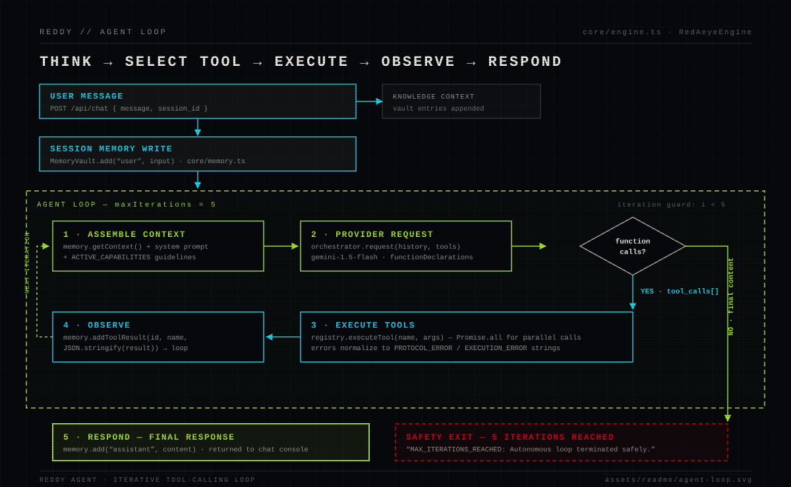

### Agent loop

`RedAeyeEngine` (`core/engine.ts`) is the operational core. One execution:

1. The user message is written into the session's `MemoryVault` (`memory.add("user", input)`).
2. For up to **five iterations**, the engine assembles context: `memory.getContext()` plus the compiled skill guidelines injected as an `ACTIVE_CAPABILITIES` system message.
3. The history and the current tool schemas go to the provider (`orchestrator.request(history, tools)`).
4. If the response carries function calls, each one runs through the registry (`registry.executeTool(name, args)`, parallel calls via `Promise.all`) and the JSON-serialized result is written back into memory as a `tool` message — then the loop continues.
5. If the response carries final content, it is stored as the assistant message and returned to the console.
6. If five iterations pass without final content, the loop stops on its own with `"MAX_ITERATIONS_REACHED: Autonomous loop terminated safely."`

The iteration cap is a hard bound, not a marketing number — it is the `maxIterations` field in `core/engine.ts`, and the [test suite](#test-suite) pins it: a provider that always requests tools gets exactly five rounds, never more.

### Provider orchestration

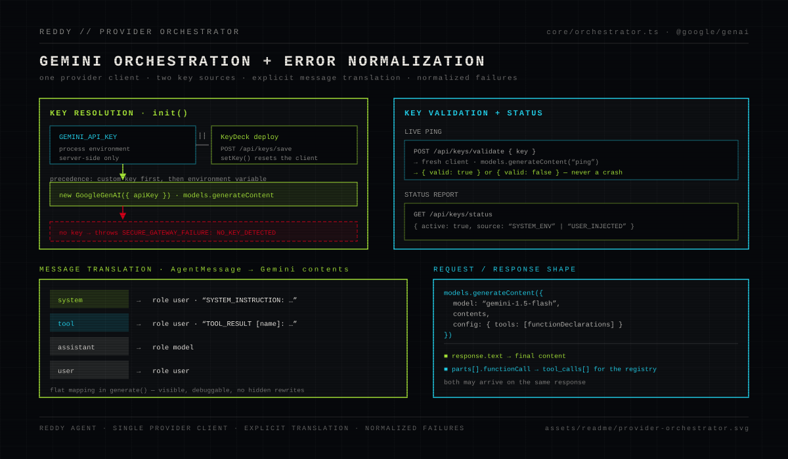

`ProviderOrchestrator` (`core/orchestrator.ts`) is the single gateway to Gemini:

- **Key resolution** — an in-process custom key (deployed from KeyDeck via `POST /api/keys/save`, which calls `setKey()` and resets the client) takes precedence over `GEMINI_API_KEY` from the environment. With neither, `init()` throws the normalized `SECURE_GATEWAY_FAILURE: NO_KEY_DETECTED` error rather than crashing the request path.
- **Message translation** — an explicit, flat mapping from `AgentMessage[]` to Gemini `contents`: `system` becomes a user turn prefixed `SYSTEM_INSTRUCTION:`, `tool` becomes a user turn prefixed `TOOL_RESULT [name]:`, `assistant` maps to the `model` role. No hidden rewrites.
- **Request** — one call surface, `models.generateContent({ model: "gemini-1.5-flash", contents, config: { tools } })`, with registry schemas passed as `functionDeclarations`.
- **Response** — `response.text` becomes the final content; `parts[].functionCall` entries become `tool_calls[]` for the registry.
- **Validation** — `validateKey()` verifies a candidate key with a live `"ping"` generation and normalizes every failure to `false`, never a throw.

> **Fixed during this repository's verification cycle:** the provider calls originally targeted the legacy `getGenerativeModel()` surface, which does not exist on the `@google/genai` 2.x client in `package.json` — every chat request would have failed with a `TypeError` before reaching the network. The calls now use the 2.x `models.generateContent` surface and `response.text` property. The regression is covered by tests in `tests/orchestrator.test.ts`.

### Session memory and context pruning

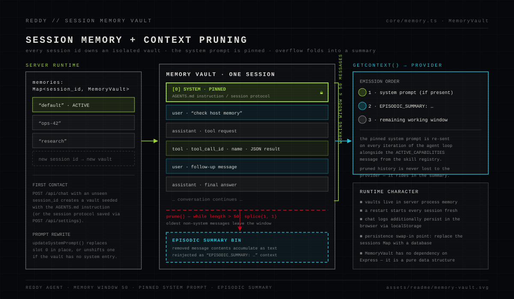

`MemoryVault` (`core/memory.ts`) is a pure data structure with no dependency on Express:

- **Isolation** — `server.ts` keeps a `Map<session_id, MemoryVault>`; a first message for an unseen session id creates a vault seeded with the `AGENTS.md` instruction (or that session's saved protocol).
- **Working window** — the vault holds up to **50 messages**. When a write exceeds the window, `prune()` removes the oldest non-first message (`splice(1, 1)`) and folds its content into an `episodicSummary` string.
- **Pinned system prompt** — slot 0 is never pruned. `updateSystemPrompt()` rewrites it in place (or unshifts one if absent), which is how the settings API changes behavior mid-session.
- **Emission order** — `getContext()` always returns: system prompt → `EPISODIC_SUMMARY: …` (if any) → the remaining working window. Pruned history keeps riding along in the summary instead of vanishing.

### Tool registry and tool contracts

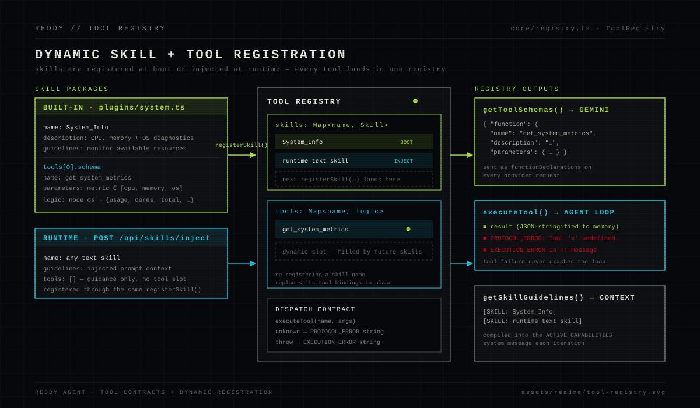

`ToolRegistry` (`core/registry.ts`) holds two maps — `skills: Map<name, Skill>` and `tools: Map<name, logic>` — and one intake function, `registerSkill()`:

- A **skill** is `{ name, description, guidelines, tools[] }`; each tool is a `{ schema, logic }` pair where the schema (`name`, `description`, JSON-schema `parameters`) is a provider-facing contract and `logic` is plain executable code.
- Registration is **dynamic** — the same call loads the built-in skill at boot and injected skills at runtime, and re-registering a name replaces its tool bindings in place.
- `getToolSchemas()` emits every tool as a Gemini `functionDeclarations` entry; `getSkillGuidelines()` compiles `[SKILL: name]` blocks into the `ACTIVE_CAPABILITIES` context message sent on every iteration.
- `executeTool()` normalizes failure: an unknown tool yields the string `PROTOCOL_ERROR: Tool 'x' undefined.`, and a throwing tool yields `EXECUTION_ERROR in x: <message>` — a bad tool degrades to data, never a crash.

### Dynamic skill loading

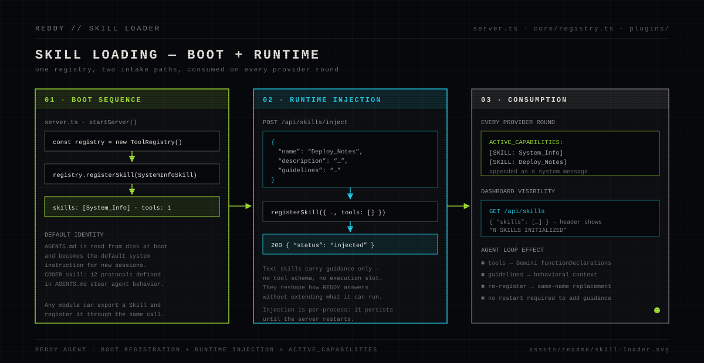

Two intake paths feed one registry:

- **Boot** — `server.ts` calls `registry.registerSkill(SystemInfoSkill)` while starting. That is the entire boot-time skill set: one skill, one tool.
- **Runtime** — `POST /api/skills/inject { name, description, guidelines }` registers a text-only skill (`tools: []`) in the live process. It reshapes how REDDY answers (its guidelines join `ACTIVE_CAPABILITIES`) without extending what it can execute, and it persists until the server restarts.

The default persona and operating rules — the CODER skill and its twelve protocols — are defined in [`AGENTS.md`](AGENTS.md), read from disk at boot, and set as the default system instruction for new sessions.

### Knowledge Vault

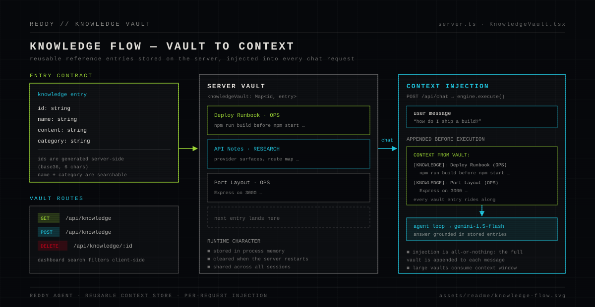

The knowledge vault is a server-side `Map<id, entry>` of `{ id, name, content, category }` records managed through three routes (`GET`/`POST /api/knowledge`, `DELETE /api/knowledge/:id`). On every `POST /api/chat`, all entries are formatted as `[KNOWLEDGE]: name (category)` blocks and appended to the outgoing message under a `CONTEXT FROM VAULT:` header — so stored reference material (runbooks, notes, port layouts) is available to the agent without re-pasting it. The vault is shared across sessions and lives in process memory.

### Google Workspace operations

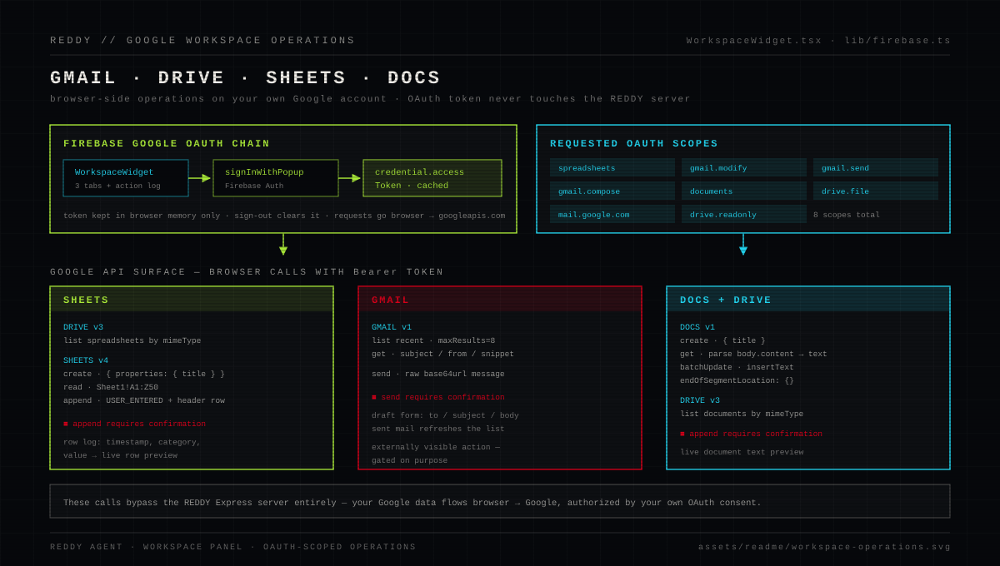

`WorkspaceWidget` operates on **your own Google account** through Firebase Google sign-in:

1. `signInWithPopup` with a `GoogleAuthProvider` carrying eight scopes (`spreadsheets`, `gmail.modify`, `gmail.send`, `gmail.compose`, `mail.google.com`, `documents`, `drive.file`, `drive.readonly`).
2. The resulting OAuth access token is cached in browser memory and cleared on sign-out.
3. The widget calls Google APIs **directly from the browser** — the REDDY server never sees that token:
   - **Sheets** — list spreadsheets (Drive v3, by MIME type), create with a title, read `Sheet1!A1:Z50`, append rows with `USER_ENTERED`
   - **Gmail** — list the 8 most recent messages, read subject/from/snippet, send a base64url-encoded message
   - **Docs** — list documents (Drive v3), create, read (parsing `body.content` paragraphs), append text via `batchUpdate` + `insertText` at the end of segment
4. Externally visible actions — appending rows, sending mail, appending to documents — are gated behind explicit browser confirmation dialogs.

### Firebase authentication and the security boundary

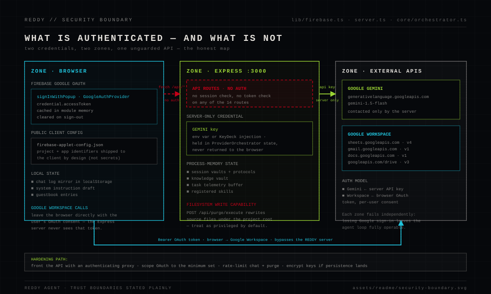

The honest map, in three zones:

- **Browser** — Firebase Authentication (Google OAuth) authorizes Google Workspace calls only. `firebase-applet-config.json` ships project and app identifiers to the client — these are public-by-design configuration, not secrets. Chat log mirrors and the guestbook persist in `localStorage`.
- **Express server** — the Gemini key (env var or KeyDeck-injected) lives only in `ProviderOrchestrator` state and is never returned to the browser. **The 14 API routes carry no authentication of their own** — no session check, no token check. Run REDDY on a trusted network or behind an authenticating proxy. `POST /api/purge/execute` rewrites source files under the project root — treat it as privileged.
- **External APIs** — Gemini is contacted only by the server (API key); Google Workspace APIs are contacted only by the browser (per-user OAuth). The zones fail independently: losing Google sign-in leaves the agent loop fully operable.

### System diagnostics

The diagnostics tool is real: the built-in `System_Info` skill exposes `get_system_metrics` to the agent, answering `cpu` (load average + core count), `memory` (total + free bytes) and `os` (platform + release) from Node's `os` module — so you can ask REDDY about its own host and get measured numbers.

The `SystemStatusMonitor` widget, by contrast, is **simulated panel instrumentation**: temperature, packet rate, CPU/RAM sliders and the overclock toggle are local UI state, not host telemetry. It is labeled as such here because a cockpit earns trust by saying which dials are wired.

### Task history and telemetry

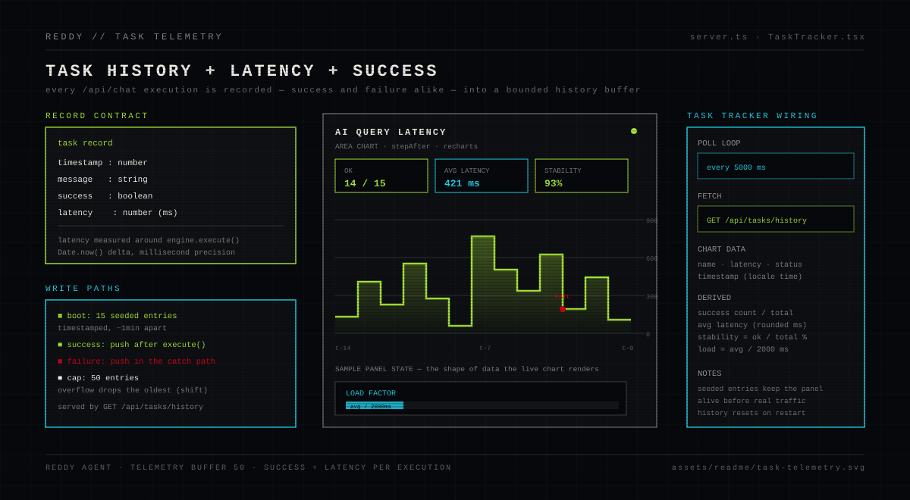

Every `POST /api/chat` writes a record `{ timestamp, message, success, latency }` — latency is the millisecond delta measured around `engine.execute()`, and the failure path records too (a chat without a key logs `success: false` with its latency; the [smoke test](#smoke-test) demonstrates this). The buffer holds 50 records and drops the oldest on overflow. At boot it is seeded with 15 labeled entries (`Task Execution #0…#14`) so the panel is populated before real traffic.

`TaskTracker` polls `GET /api/tasks/history` every 5 seconds and renders the latency series as a `stepAfter` area chart, with success ratio, average latency, a stability bar (success/total) and a load factor (average latency / 2000 ms) — all derived from the records, nothing invented.

### API-key management

KeyDeck drives the three key routes:

- `POST /api/keys/validate { key }` — live validation ping against Gemini; returns `{ valid: true|false }`.
- `POST /api/keys/save { key }` — deploys the key to the running process (takes precedence over the environment variable; lost on restart).
- `GET /api/keys/status` — reports `{ active: true, source: "SYSTEM_ENV" | "USER_INJECTED" }` depending on whether the key came from the environment or from the in-app panel.

Both paths keep the key server-side; the browser only ever learns the source label, never the key.

### Purge and reset operations

The purge pipeline audits the codebase itself:

- `GET /api/purge/audit` — recursively scans `src/` for `TODO_COMMENT` lines (`TODO:` markers) and `MOCK_STATIC_DATA` lines (`DEFAULT_ENTRIES` / `PLAYLIST` declarations), returning file, line, text and category for each finding. The current audit of this repository returns 2 findings, both in `src/components/GuestbookWidget.tsx`.
- `POST /api/purge/execute { items }` — for confirmed findings, rewrites TODO lines to `RESOLVED: Purged by REDDY MOCK_PURGE Protocol.` markers and prefixes static mock declarations with a `DEPLOYED PROSTHETIC CHIP` marker. Items whose text no longer matches the file line are skipped, and edits apply bottom-up so line numbers stay valid.

This endpoint modifies source files — review audit results before executing, and keep it away from untrusted networks.

### API console

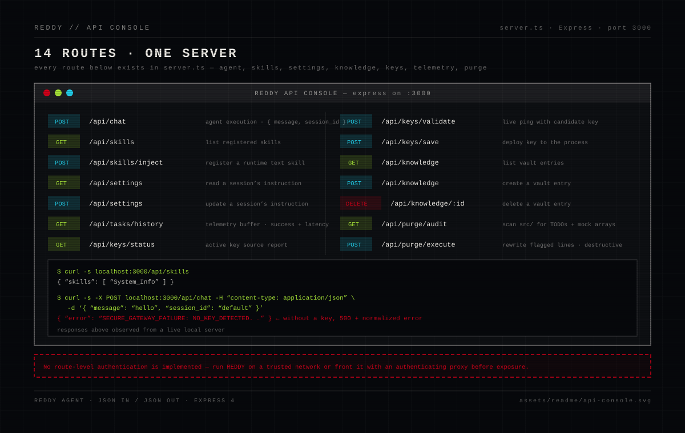

Fourteen routes, one server, JSON in and JSON out:

| Method | Route | Purpose |
|---|---|---|
| `POST` | `/api/chat` | Agent execution (`message`, `session_id`) |
| `GET` | `/api/skills` | List registered skills |
| `POST` | `/api/skills/inject` | Register a runtime text skill |
| `GET` | `/api/settings` | Read a session's instruction |
| `POST` | `/api/settings` | Update a session's instruction |
| `GET` | `/api/knowledge` | List vault entries |
| `POST` | `/api/knowledge` | Create a vault entry |
| `DELETE` | `/api/knowledge/:id` | Delete a vault entry |
| `POST` | `/api/keys/validate` | Live-validate a candidate Gemini key |
| `POST` | `/api/keys/save` | Deploy a key to the process |
| `GET` | `/api/keys/status` | Report active key source |
| `GET` | `/api/tasks/history` | Task telemetry buffer |
| `GET` | `/api/purge/audit` | Scan `src/` for TODOs and mock data |
| `POST` | `/api/purge/execute` | Rewrite flagged lines (destructive) |

---

## Install, configure, build

### Requirements

- Node.js (18+) and npm
- A Google Gemini API key for AI features (obtain one from Google AI Studio)
- A Firebase project with Google sign-in enabled, for Google Workspace features
- Google Cloud APIs and OAuth scopes enabled for the Workspace operations you use

### Install

```bash
git clone https://github.com/reARbitRA/Reddy-Agent.git
cd Reddy-Agent
npm install
```

### Environment

Copy `.env.example` to `.env` and fill it in. Every variable in the template is read by the code:

| Variable | Required | Read by | Default |
|---|---|---|---|
| `GEMINI_API_KEY` | For AI features | `core/orchestrator.ts`, `server.ts` | — |
| `GEMINI_MODEL` | No | `core/orchestrator.ts` (`resolveModel`) | `gemini-3.8-flash` |
| `REDDY_API_TOKEN` | **Yes for any non-localhost deployment** | `server.ts` (`requireApiAuth`) | unset → `INSECURE_ANONYMOUS_MODE` |
| `ALLOWED_DEV_HOSTS` | No | `vite.config.ts` | `localhost,127.0.0.1` |
| `PORT` | No | `server.ts` | `3000` |
| `NODE_ENV` | No | `server.ts` (`production` serves `dist/` statically) | development mode |
| `DISABLE_HMR` | No | `vite.config.ts` (`true` disables HMR + file watching) | HMR on |

Firebase and Google Workspace configuration is not environment-driven: the client uses `firebase-applet-config.json`, and scopes are declared in `src/lib/firebase.ts`. Do not commit private API keys, OAuth secrets, service credentials, or production tokens.

### Development server

```bash
npm run dev
```

Runs `tsx server.ts`: Express on port 3000 with Vite middleware for the dashboard — one process, one origin, hot reload. Open `http://localhost:3000`.

### Production build

```bash
npm run build
NODE_ENV=production npm start
```

`npm run build` produces the hashed frontend bundle in `dist/assets/` and bundles the server with esbuild into `dist/server.cjs`. `npm start` runs it; with `NODE_ENV=production`, Express serves `dist/` as static files with an SPA fallback on unknown paths. The API keeps the same paths in both lanes.

### Scripts

```text
npm run dev            Start the Express/Vite development server
npm run build          Build the frontend and bundle the server
npm start              Run the built server (dist/server.cjs)
npm test               Run the vitest suite (57 tests)
npm run lint           TypeScript check without emitting (tsc --noEmit)
npm run verify:assets  Strict SVG verification for assets/readme
npm run verify:readme  Verify README image paths and anchors
npm run clean          Remove dist/
```

### Test suite

The repository ships a vitest suite — 57 tests across 7 files, all runnable offline against the real code:

| File | Tests | Pins down |
|---|---|---|
| `tests/memory.test.ts` | 10 | Session storage, pinned system prompt, 50-message pruning, episodic summary |
| `tests/registry.test.ts` | 9 | Skill/tool registration, schema emission, replacement, error strings |
| `tests/skills.test.ts` | 8 | `System_Info` contract, real `get_system_metrics` results, text-skill loading |
| `tests/engine.test.ts` | 6 | Loop order, tool execution flow, parallel calls, 5-iteration cap |
| `tests/orchestrator.test.ts` | 5 | Missing-key normalization, invalid-key → `false` |
| `tests/api.test.ts` | 14 | Boots the real server as a child process; all route groups, validation guards, key-status sources, telemetry writes |
| `tests/purge.test.ts` | 5 | Audit scan, rewrite rules, stale-line skip — against a fixture copy |

```bash
npm test
```

The two integration files spawn `server.ts` itself (via `tsx`) on free ports with a controlled environment — they exercise the actual Express app, not a re-implementation. Unit tests for the engine use a clearly-labeled stub orchestrator; no mock pretends to be Gemini.

### Smoke test

Run the server (`npm run dev`), then verify the live surface. These are the commands and the responses observed from a fresh boot of this repository:

```text
$ curl -s -o /dev/null -w "%{http_code} %{content_type}" http://localhost:3000/
200 text/html

$ curl -s http://localhost:3000/api/skills
{"skills":["System_Info"]}

$ curl -s http://localhost:3000/api/keys/status
{"active":true,"source":"USER_INJECTED"}

$ curl -s http://localhost:3000/api/tasks/history | head -c 120
{"history":[{"timestamp":1790632710809,"message":"Task Execution #0","success":true,"latency":411},...
```

Validation guards respond as designed:

```text
$ curl -s -w " [%{http_code}]" -X POST localhost:3000/api/keys/validate \
    -H "content-type: application/json" -d '{}'
{"error":"Missing key"} [400]

$ curl -s -w " [%{http_code}]" -X POST localhost:3000/api/purge/execute \
    -H "content-type: application/json" -d '{}'
{"error":"Missing items to purge"} [400]
```

Without a Gemini key configured, chat fails closed with the normalized provider error — and the telemetry buffer records the failure:

```text
$ curl -s -w " [%{http_code}]" -X POST localhost:3000/api/chat \
    -H "content-type: application/json" \
    -d '{"message":"hello","session_id":"smoke"}'
{"error":"SECURE_GATEWAY_FAILURE: NO_KEY_DETECTED. Please insert a valid OMEGA key."} [500]

$ curl -s http://localhost:3000/api/tasks/history   # last record:
{"timestamp":1790633628855,"message":"hello","success":false,"latency":1}
```

The built server was smoke-tested the same way (`PORT=3131 NODE_ENV=production node dist/server.cjs`): `GET /` serves the bundle with `200 text/html`, the API routes respond identically, and unknown paths fall back to `index.html` for the SPA.

### Deployment

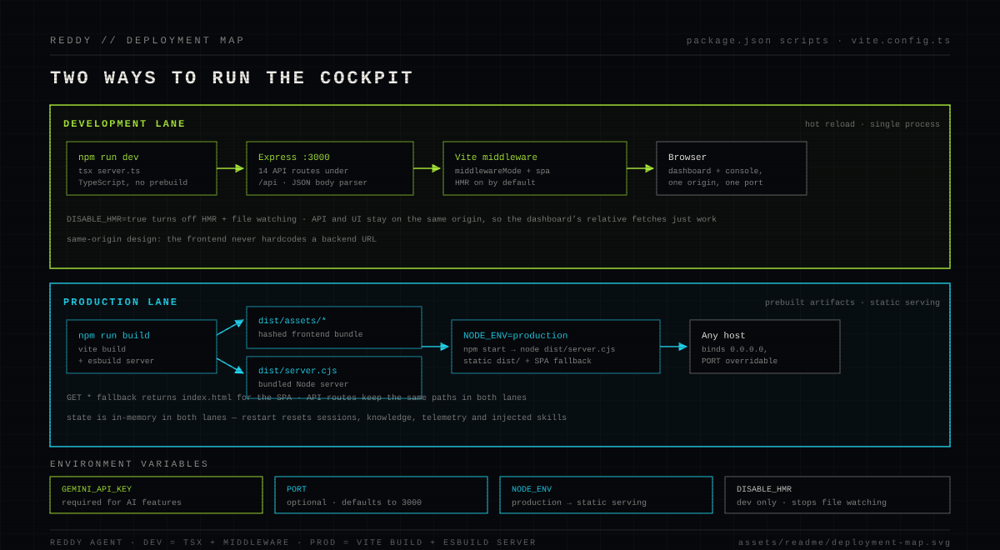

Two lanes, one codebase:

- **Development** — `npm run dev` runs TypeScript directly through `tsx`, mounting Vite middleware inside Express. One origin means the dashboard's relative `fetch` calls work with zero configuration.
- **Production** — `npm run build` emits `dist/assets/*` (frontend) and `dist/server.cjs` (server). `NODE_ENV=production npm start` serves them; the server binds `0.0.0.0` and honors `PORT`.

Before exposing REDDY beyond localhost: put an authenticating proxy in front of the API (see the [security boundary](#firebase-authentication-and-the-security-boundary)), use HTTPS, and restrict the Google OAuth scopes to the operations you actually need.

### Operational characteristics

Stated plainly, because a cockpit you can't trust is a toy:

- Conversations, session protocols, knowledge entries, injected skills and task history are held in **process memory** — a restart resets them to defaults. Chat logs also mirror into browser `localStorage`, and the guestbook persists there.
- Task history boots with **15 seeded entries** (labeled `Task Execution #N`) so the telemetry panel is populated before real executions arrive.
- The `SystemStatusMonitor` gauges are **simulated UI state**, not host telemetry; real host metrics come from the `get_system_metrics` tool.
- The Suno widget's preset tracks and the guestbook's default entries are local seed data.
- The Gemini model defaults to `gemini-3.8-flash` and is resolved in one place (`resolveModel()` in `core/orchestrator.ts`). Models Google has shut down — `gemini-1.0-*`, `gemini-1.5-*`, `gemini-2.0-flash` — are rejected at resolution time with `MODEL_RETIRED` instead of 404ing at request time. Override with `GEMINI_MODEL`.
- `firebase-applet-config.json` is public-by-design Firebase **web client** configuration, not a secret. Restrict that web API key by HTTP referrer in the Firebase console and enable App Check for Authentication; the repository cannot enforce either.
- There is **no license file** in this repository — resolve licensing before redistributing.
- For a persistent multi-user deployment, replace the in-memory maps with a database and add authentication around the stateful routes; `MemoryVault` and `ToolRegistry` are dependency-light on purpose to make that swap straightforward.

### Troubleshooting

| Symptom | Cause and fix |
|---|---|
| `SECURE_GATEWAY_FAILURE: NO_KEY_DETECTED` on chat | No key configured. Set `GEMINI_API_KEY` in `.env`, or deploy one through KeyDeck. |
| `{"valid": false}` on a key you believe is valid | The validation ping failed — check the key's API access, project quotas and network egress; every failure normalizes to `false`. |
| Workspace panel shows the authorization card | Not signed in, or the OAuth token was not cached — click **Link Google Account**. |
| Workspace operations fail after sign-in | Scopes or Google Cloud APIs not enabled for the project; check the scope list in `src/lib/firebase.ts`. |
| Everything resets after a restart | Expected: runtime state is in-memory (see above). |
| Port already in use | Set `PORT` to another value; the server reads it at startup. |

---

## Verification

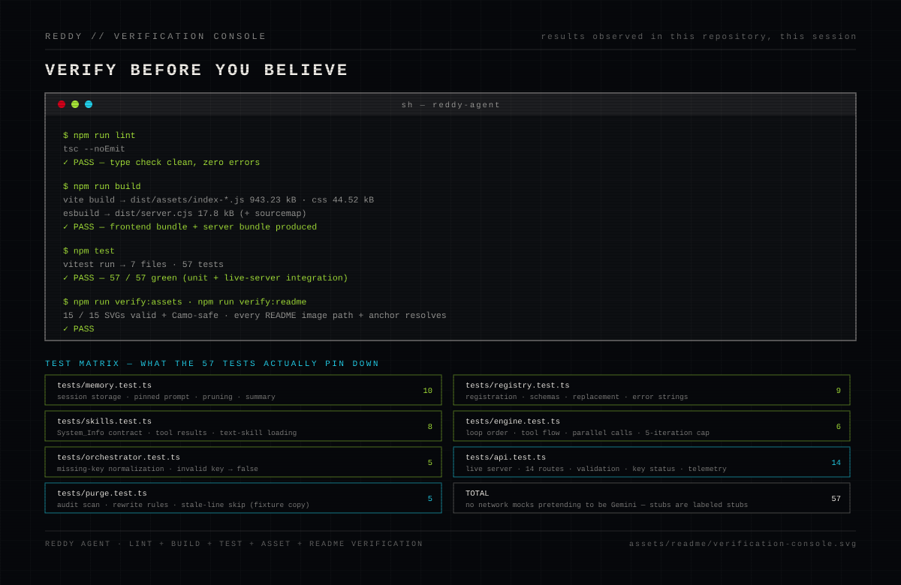

Every claim in this README was checked in this repository during the presentation cycle:

```text
npm run lint           tsc --noEmit — clean
npm run build          dist/assets/index-*.js 943.23 kB · css 44.52 kB · dist/server.cjs 17.8 kB
npm test               7 files · 57 tests — 57/57 passing
npm run verify:assets  15/15 SVGs valid and Camo-safe
npm run verify:readme  image paths, anchors and file links all resolve
git diff --check       no whitespace errors
```

Live smoke tests against both the development server and the built production server produced the outputs quoted in [Smoke test](#smoke-test). The one defect the cycle surfaced — the `@google/genai` 2.x surface mismatch in the provider — is fixed and regression-tested.

---

## Repository layout

```text
AGENTS.md                  Agent identity, CODER skill, 12 operating protocols
server.ts                  Express entry: routes, runtime state, Vite/static serving
core/
  engine.ts                RedAeyeEngine — iterative agent loop, 5-iteration cap
  orchestrator.ts          ProviderOrchestrator — Gemini gateway, key resolution
  memory.ts                MemoryVault — session window, pruning, episodic summary
  registry.ts              ToolRegistry — skills, tools, schemas, dispatch
plugins/
  system.ts                System_Info skill — get_system_metrics tool
src/
  App.tsx                  Dashboard shell, chat terminal, settings and purge panels
  main.tsx                 React bootstrap
  types.ts                 Shared contracts (Skill, AgentMessage, ToolSchema)
  index.css                Tailwind entry + CRT/brutalist visual system
  components/              12 dashboard widgets (see the interface map)
  lib/firebase.ts          Firebase init, Google OAuth, token cache
tests/                     vitest suite — 7 files, 57 tests
scripts/
  verify-svg.mjs           Strict SVG verification (Camo safety, palette, a11y)
  verify-readme.mjs        README path + anchor verification
assets/readme/             15 hand-authored SVG diagrams (this presentation)
firebase-applet-config.json  Firebase client configuration
vite.config.ts             Vite, React, Tailwind, alias, dev-server behavior
.env.example               Environment template — every variable is code-read
```

---

## Open engineering questions

The honest backlog, in rough priority order:

1. **API authorization** — the 14 routes are unauthenticated by design for local use. What is the smallest auth layer (proxy or middleware) that fits a personal deployment without adding a user database?
2. **Persistence** — sessions, knowledge, telemetry and injected skills live in process memory. Which store first: knowledge (small, valuable) or sessions (large, ephemeral)?
3. **Google API key handling in the browser** — the OAuth flow is correct, but the widget stores the access token in a module-level cache; is a session-scoped store worth the added complexity?
4. **Telemetry seeding** — should the boot-time seeded task entries be visually distinguished from real records in the chart?
5. **Provider surface** — `gemini-1.5-flash` is pinned in code; should the model be configurable via settings without exposing model choice to the chat panel?

---

